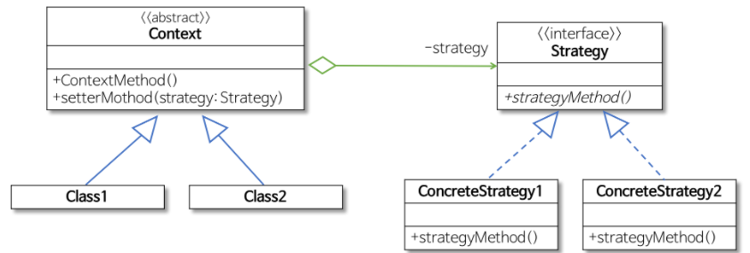
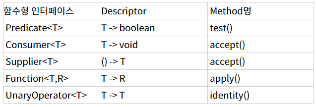

- 참고 : https://gmlwjd9405.github.io/2018/07/06/strategy-pattern.html

# 스트래티지 패턴 (OopAnotherExample.java)
- 행위를 클래스로 캡슐화해 동적으로 행위를 자유롭게 바꿀 수 있게 해주는 패턴
    - 같은 문제를 해결하는 여러 알고리즘이 클래스별로 캡슐화되어 있고 이들이 필요할 때 교체할 수 있도록
    함으로써 동일한 문제를 다른 알고리즘으로 해결할 수 있게 하는 디자인 패턴
    - 행위(Behavioral) 패턴의 하나
    - **전략을 쉽게 바꿀 수 있도록** 해주는 디자인 패턴
        - 전략
            - 어떤 목적을 달성하기 위해 일을 수행하는 방식, 비즈니스 규칙, 문제를 해결하는 알고리즘 등
    - 특히 게임 프로그래밍에서 게임 캐릭터가 자신이 처한 상황에 따라 공격이나 행동하는 방식을
    바꾸고 싶을 때 스트래티지 패턴은 매우 유용
    - 
      
    - 역할이 수행하는 작업
        - Strategy
            - 인터페이스나 추상 클래스로 외부에서 동일한 방식으로 알고리즘을 호출하는 방법을 명시
        - ConcreteStrategy
            - 스트래티지 패턴에서 명시한 알고리즘을 실제로 구현한 클래스
        - Context
            - 스트래티지 패턴을 이용하는 역할을 수행한다.
            - 필요에 따라 동적으로 구체적인 전략을 바꿀 수 있도록 setter 메서드(‘집약 관계’)를 제공한다.

- 참고 : https://medium.com/@lazysoul/functional-programming-%EC%97%90%EC%84%9C-1%EA%B8%89-%EA%B0%9D%EC%B2%B4%EB%9E%80-ba1aeb048059
# 1급 객체(First-class citizen)
- 1급 객체란?
    1. 변수나 데이터에 할당할 수 있어야 함
    2. 객체의 인자로 넘길 수 있어야 함
    3. 객체의 리턴값으로 리턴할 수 있어야 함
    
- 코틀린의 함수는 1급객체, Java의 함수는 1급객체가 아님
    - 파라미터로 함수를 할당할 수 없음
    - But Java 8에서 람다를 이용해 가능해짐
    
# 자바8 람다식, 함수형 인터페이스
- Function<T,R>     .apply(), static.identity()
- Consumer<T>       .accept()
- Predicate<T>      .test()
- Supplier<T>       .get()

- 사용자 설정 함수형 인터페이스시 @FunctionalInterface

- 참고 : https://jsonobject.tistory.com/466
# BigDecimal
- BigDecimal은 Java 언어에서 숫자를 정밀하게 저장하고 표현할 수 있는 유일한 방법
- 소수점을 저장할 수 있는 가장 크기가 큰 타입인 double은 소수점의 정밀도에 있어 한계가 있어 값이 유실될 수 있음
- Java 언어에서 돈과 소수점을 다룬다면 BigDecimal은 선택이 아니라 필수이다.
- BigDecimal의 유일한 단점은 느린 속ㄷ와 기본 타입보다 조금 불편한 사용법 뿐이다.

- Stream
    - 특징
        1. Lazy
        2. Intermediate Operation Method
        3. Terminal Operation Method